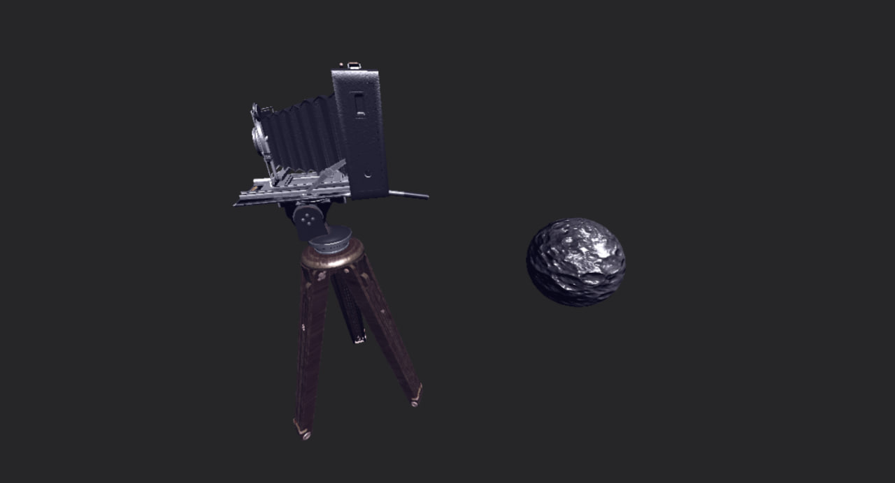

# WARP ENGINE

tl;dr
## currently implemented:
- [x] DirectX 12 RHI interface with physical/logical devices and triple-buffered swapchain
- [x] Renderer that supports three inflight frames being rendered simultaneously
- [x] DXC shader compiler interface for easy shader retrieval
- [x] Barebone PIX integration (WIP)
- [x] Meshlet rendering using Mesh/Amplification pipeline instead of IA/Vertex/Geometry/Tesselation pipeline
- [x] Asset system with Asset importer for textures (using DirectXTex) and glTF format meshes (using cgltf)
- [x] World with cameras and meshes. Rendered and manipulated with ECS using entt.
- [x] Blinn-Phong shading model with normal mapping support
- [ ] ECS-based lighting system (WIP) 

## Mesh Rendering

