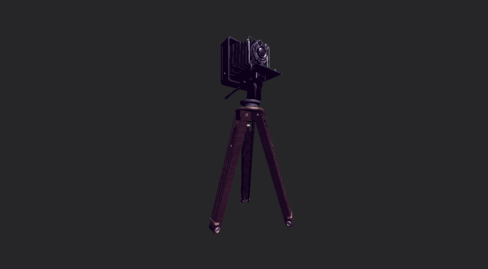

# WARP ENGINE

tl;dr
## currently implemented:
- [x] DirectX 12 RHI interface with physical/logical devices and triple-buffered swapchain
- [x] Renderer that supports three inflight frames being rendered simultaneously
- [x] DXC shader compiler interface for easy shader retrieval
- [x] Barebone PIX integration
- [x] glTF mesh loader using cgltf (WIP)
- [x] Meshlet rendering using Mesh/Amplification pipeline instead of IA/Vertex/Geometry/Tesselation pipeline (still WIP)
- [x] Asset system with for textures and meshes
- [x] World with ECS using entt. World is being rendered using Renderer 

## Mesh Rendering

