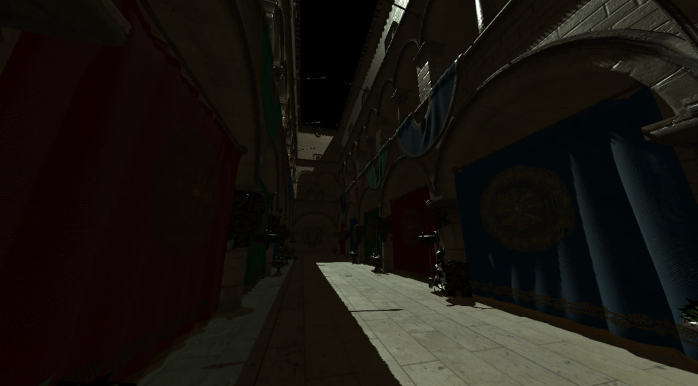

# WARP ENGINE

tl;dr
## currently implemented:
- [x] DirectX 12 RHI interface with physical/logical devices and triple-buffered swapchain
- [x] Renderer that supports three inflight frames being rendered simultaneously
- [x] DXC shader compiler interface for easy shader retrieval
- [x] PIX Profiler Integration (Still some issues with it though)
- [x] Mesh rendering using Mesh/Amplification pipeline instead of IA/Vertex/Geometry/Tesselation pipeline
- [x] Asset system for WIC textures (using DirectXTex), glTF meshes (using cgltf) and materials
- [x] World with cameras, meshes, materials and lights. Rendered and manipulated with ECS using entt.
- [x] Physically-Based shading using BRDF for directional lights (Will be expanded in future)

## Mesh Rendering

